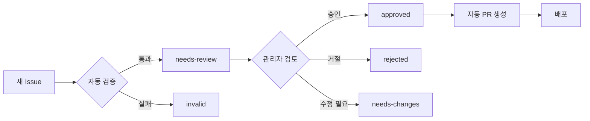

# 관리자 가이드 (Administrator Guide)

<div align="center">

**AI/ML 한국어 용어집 관리자 매뉴얼**

*GitHub 기반 자동화 시스템 가이드*

</div>

## 목차

- [관리자 역할 개요](#관리자-역할-개요)
- [권한 및 책임](#권한-및-책임)
- [GitHub 워크플로우 관리](#github-워크플로우-관리)
- [Issue 관리 시스템](#issue-관리-시스템)
- [데이터 품질 관리](#데이터-품질-관리)
- [자동화 시스템 모니터링](#자동화-시스템-모니터링)
- [긴급 상황 대응](#긴급-상황-대응)
- [관리 도구 및 스크립트](#관리-도구-및-스크립트)
- [FAQ 및 트러블슈팅](#faq-및-트러블슈팅)

## 관리자 역할 개요

### 핵심 책임
- **품질 관리**: 용어의 정확성 및 일관성 보장
- **커뮤니티 관리**: 기여자와의 소통 및 가이드 제공
- **시스템 관리**: 자동화 워크플로우 모니터링 및 유지보수
- **정책 수립**: 용어 승인 기준 및 가이드라인 정의

### 관리 범위
- GitHub Issues 검토 및 승인/거절
- 자동화 워크플로우 상태 모니터링
- 데이터 무결성 및 품질 확인
- 커뮤니티 가이드라인 시행

## 권한 및 책임

### 필수 GitHub 권한
- **Repository Admin**: 저장소 설정 및 브랜치 보호 규칙 관리
- **Issues Management**: Issue 라벨 관리 및 상태 변경
- **Actions Management**: GitHub Actions 워크플로우 관리
- **Pages Management**: GitHub Pages 배포 설정

### 관리자 등급 시스템

| 등급 | 권한 | 책임 |
|------|------|------|
| **Lead Admin** | 모든 권한, 새 관리자 임명 | 전체 시스템 관리, 정책 수립 |
| **Senior Admin** | Issue 승인, 시스템 모니터링 | 용어 검토, 품질 관리 |
| **Junior Admin** | Issue 검토, 피드백 제공 | 초기 검토, 커뮤니티 지원 |

### 관리자 목록 관리

관리자 정보는 `.github/config/admins.json`에 저장됩니다:

```json
{
  "admins": [
    {
      "githubUsername": "admin1",
      "name": "관리자 이름",
      "role": "lead",
      "permissions": ["all"],
      "email": "admin@example.com",
      "expertise": ["machine-learning", "nlp"],
      "joinDate": "2024-01-01",
      "status": "active"
    }
  ]
}
```

## GitHub 워크플로우 관리

### 주요 워크플로우 파일

#### 1. `.github/workflows/data-management.yml`
**목적**: Issue 승인 시 자동 데이터 처리
**트리거**: Issue 라벨 변경 (`approved`, `rejected`)

```yaml
# 주요 작업
- Issue 데이터 추출 및 검증
- 자동 PR 생성 및 병합
- 데이터 무결성 확인
```

#### 2. `.github/workflows/issue-validation.yml`
**목적**: 새 Issue 자동 검증
**트리거**: Issue 생성/수정

```yaml
# 검증 항목
- 필수 필드 완성도
- 데이터 형식 유효성
- 중복 검사
- 자동 라벨링
```

#### 3. `.github/workflows/deploy.yml`
**목적**: GitHub Pages 자동 배포
**트리거**: main 브랜치 푸시

```yaml
# 배포 과정
- 빌드 및 테스트
- 데이터 전처리
- GitHub Pages 배포
```

### 워크플로우 모니터링

#### Actions 탭에서 확인할 내용
1. **성공률**: 각 워크플로우의 성공/실패 비율
2. **실행 시간**: 평균 실행 시간 및 성능 추세
3. **오류 패턴**: 자주 발생하는 오류 유형
4. **리소스 사용량**: GitHub Actions 사용량

#### 모니터링 명령어
```bash
# 최근 워크플로우 실행 상태 확인
gh run list --limit 20

# 특정 워크플로우 로그 확인
gh run view [RUN_ID] --log

# 워크플로우 수동 실행
gh workflow run "Data Management Workflow"
```

## Issue 관리 시스템

### Issue 생명 주기



### Issue 라벨 시스템

#### 유형 라벨 (자동 할당)
- `type:term-addition` - 새 용어 추가
- `type:term-modification` - 기존 용어 수정
- `type:contributor-addition` - 기여자 등록
- `type:organization-addition` - 조직 등록
- `type:admin-addition` - 관리자 추천
- `type:verification-org-addition` - 검증 기관 등록

#### 상태 라벨 (관리자 수동 관리)
- `status:needs-review` - 검토 필요 (기본)
- `status:approved` - 승인됨 (자동 처리 트리거)
- `status:rejected` - 거절됨
- `status:needs-changes` - 수정 필요
- `status:on-hold` - 보류

#### 우선순위 라벨
- `priority:high` - 높음
- `priority:medium` - 중간 (기본)
- `priority:low` - 낮음

#### 전문 분야 라벨
- `domain:machine-learning`
- `domain:deep-learning`
- `domain:nlp`
- `domain:computer-vision`
- `domain:data-science`

### 관리자 검토 가이드

#### 1. 용어 추가/수정 검토

**필수 확인 사항:**
- ✅ 한글/영어 용어의 정확성
- ✅ 정의의 명확성 및 정확성
- ✅ 예시의 적절성
- ✅ 참고문헌의 신뢰성
- ✅ 중복 용어 여부

**승인 기준:**
- 학술적으로 검증된 용어
- 업계에서 널리 사용되는 용어
- 명확한 정의와 적절한 예시 제공

**거절 사유:**
- 부정확하거나 모호한 정의
- 이미 존재하는 용어
- 학술적 근거 부족
- 부적절한 내용

#### 2. 기여자/조직 등록 검토

**확인 사항:**
- ✅ GitHub 프로필 실존 여부
- ✅ 전문성 관련 증빙 자료
- ✅ 연락처 정보 유효성
- ✅ 이미 등록된 기여자/조직 여부

#### 검토 프로세스

```bash
# 1. Issue 세부 내용 확인
gh issue view [ISSUE_NUMBER]

# 2. 기여자 프로필 확인 (용어 관련)
gh api users/[USERNAME]

# 3. 라벨 추가/변경
gh issue edit [ISSUE_NUMBER] --add-label "approved"
gh issue edit [ISSUE_NUMBER] --add-label "status:needs-changes"

# 4. 댓글로 피드백 제공
gh issue comment [ISSUE_NUMBER] --body "승인합니다. 자동 처리됩니다."
```

## 데이터 품질 관리

### 자동 검증 시스템

프로젝트에는 다음과 같은 자동 검증 스크립트가 포함되어 있습니다:

#### `scripts/validate-terms.py`
```python
# 용어 데이터 유효성 검증
- JSON 스키마 검증
- 필수 필드 존재 여부
- 데이터 타입 정확성
```

#### `scripts/check-duplicates.py`
```python
# 중복 데이터 검사
- 동일한 영어/한글 용어
- 비슷한 용어 탐지 (Levenshtein distance)
```

#### `scripts/validate-sorting.py`
```python
# 정렬 순서 검증
- 알파벳 순 정렬 확인
- 데이터 구조 일관성
```

### 수동 품질 관리

#### 월간 품질 점검 체크리스트

- [ ] 전체 용어 데이터 백업
- [ ] 중복 용어 전면 검사
- [ ] 링크된 참고문헌 유효성 확인
- [ ] 기여자 정보 최신성 검증
- [ ] 조직 정보 업데이트 상태 확인

#### 품질 지표 모니터링

```bash
# 총 용어 수 확인
jq length data/terms/terms-a-z.json

# 최근 업데이트된 용어 확인
jq '.[] | select(.metadata.updatedAt > "2024-01-01") | .english' data/terms/terms-a-z.json

# 상태별 용어 분포 확인
jq 'group_by(.status) | map({status: .[0].status, count: length})' data/terms/terms-a-z.json
```

## 자동화 시스템 모니터링

### 핵심 모니터링 지표

#### 1. 워크플로우 성공률
```bash
# 최근 50개 워크플로우 실행 성공률 확인
gh run list --limit 50 --json status,conclusion | jq '[.[] | select(.status == "completed")] | group_by(.conclusion) | map({conclusion: .[0].conclusion, count: length})'
```

#### 2. 처리 시간 모니터링
```bash
# 평균 처리 시간 확인
gh run list --limit 20 --json createdAt,updatedAt | jq '.[] | ((.updatedAt | strptime("%Y-%m-%dT%H:%M:%SZ") | mktime) - (.createdAt | strptime("%Y-%m-%dT%H:%M:%SZ") | mktime)) / 60' | awk '{sum+=$1; count++} END {print "Average minutes:", sum/count}'
```

#### 3. 에러 패턴 분석
```bash
# 최근 실패한 워크플로우 로그 확인
gh run list --status failure --limit 10 --json databaseId | jq -r '.[] | .databaseId' | head -5 | xargs -I {} gh run view {} --log
```

### 알림 설정

#### GitHub Notifications
- Repository watching을 "All Activity"로 설정
- 실패한 워크플로우에 대한 이메일 알림 활성화

#### 외부 모니터링 (선택사항)
```yaml
# .github/workflows/monitoring.yml
name: System Health Check
on:
  schedule:
    - cron: '0 */6 * * *'  # 6시간마다 실행

jobs:
  health-check:
    runs-on: ubuntu-latest
    steps:
      - name: Check system status
        run: |
          # 데이터 파일 존재 및 크기 확인
          # 최근 활동 상태 확인
          # 외부 서비스 연결 테스트
```

## 긴급 상황 대응

### 비상 연락체계

#### 1단계: 자동 복구 시도
- GitHub Actions 워크플로우 재실행
- 캐시 클리어 및 재배포

#### 2단계: 수동 개입
- 문제 있는 데이터 수동 수정
- 임시 우회 방법 적용

#### 3단계: 시스템 복원
- 백업에서 데이터 복원
- 시스템 재시작

### 일반적인 긴급 상황

#### 1. 자동화 워크플로우 실패
```bash
# 워크플로우 상태 확인
gh run list --workflow="Data Management Workflow" --limit 5

# 실패한 워크플로우 재실행
gh run rerun [RUN_ID]

# 수동으로 Issue 처리
python .github/scripts/process-term-data.py --issue-data-file issue_data.json --action add
```

#### 2. 잘못된 데이터 배포
```bash
# Git 히스토리에서 이전 버전 복원
git log --oneline data/terms/terms-a-z.json
git checkout [COMMIT_HASH] -- data/terms/terms-a-z.json
git commit -m "🔥 Revert incorrect data changes"
git push origin main
```

#### 3. 대량의 스팸 Issues
```bash
# 일괄 Issue 닫기 (주의 필요)
gh issue list --label "spam" --json number | jq -r '.[] | .number' | xargs -I {} gh issue close {} --comment "스팸으로 판단되어 닫습니다."
```

## 관리 도구 및 스크립트

### 필수 CLI 도구

#### GitHub CLI 설정
```bash
# GitHub CLI 설치 및 인증
gh auth login

# 저장소 클론
gh repo clone 9bow/kr-glossary
cd kr-glossary

# 기본 설정
gh alias set issues-pending 'issue list --label "status:needs-review"'
gh alias set approve-issue '!gh issue edit $1 --add-label approved'
```

#### 관리 스크립트 실행
```bash
# Python 환경 설정
pip install -r requirements.txt

# 데이터 검증
python scripts/validate-terms.py
python scripts/check-duplicates.py
python scripts/validate-sorting.py

# 통계 생성
python scripts/generate-statistics.py
```

### 관리자 전용 스크립트

#### 1. 대량 Issue 처리 스크립트
```python
# scripts/bulk-issue-processing.py
# 여러 Issue를 한 번에 승인/거절하는 스크립트
```

#### 2. 데이터 백업 스크립트
```bash
# scripts/backup-data.sh
#!/bin/bash
BACKUP_DIR="backups/$(date +%Y%m%d_%H%M%S)"
mkdir -p "$BACKUP_DIR"
cp -r data/ "$BACKUP_DIR/"
echo "백업 완료: $BACKUP_DIR"
```

#### 3. 성능 모니터링 스크립트
```python
# scripts/performance-monitor.py
# 시스템 성능 지표 수집 및 보고서 생성
```

### 정기 유지보수 작업

#### 일간 작업
- [ ] 새 Issue 검토 (gh issues-pending)
- [ ] 워크플로우 실패 여부 확인
- [ ] 커뮤니티 질문 응답

#### 주간 작업
- [ ] 데이터 품질 검증 실행
- [ ] 성능 지표 검토
- [ ] 기여자 통계 업데이트

#### 월간 작업
- [ ] 전체 시스템 백업
- [ ] 외부 링크 유효성 검사
- [ ] 용어 사용 통계 분석
- [ ] 커뮤니티 성장 지표 리뷰

## FAQ 및 트러블슈팅

### 자주 묻는 질문

#### Q1: Issue가 자동으로 처리되지 않아요
**A1**: 다음을 확인하세요:
1. Issue에 올바른 라벨이 있는지 (`approved`)
2. GitHub Actions가 정상 작동하는지
3. 데이터 검증이 통과했는지

```bash
# 워크플로우 로그 확인
gh run list --workflow="Data Management Workflow" --limit 3
gh run view [RUN_ID] --log
```

#### Q2: 중복 용어가 추가되었어요
**A2**: 중복 검사 스크립트를 실행하고 수동으로 제거:
```bash
python scripts/check-duplicates.py
# 중복 용어를 직접 편집
git add data/terms/terms-a-z.json
git commit -m "Remove duplicate terms"
git push origin main
```

#### Q3: 기여자가 GitHub에서 찾을 수 없어요
**A3**: GitHub API로 확인:
```bash
gh api users/[USERNAME] || echo "사용자가 존재하지 않습니다"
```

### 일반적인 오류 해결

#### 워크플로우 권한 오류
```yaml
# .github/workflows/data-management.yml에서 권한 확인
permissions:
  contents: write
  issues: write
  pull-requests: write
```

#### JSON 파싱 오류
```bash
# JSON 유효성 검사
jq empty data/terms/terms-a-z.json && echo "Valid JSON" || echo "Invalid JSON"

# 문제가 있는 경우 백업에서 복원
cp data/terms/terms-a-z.json.backup data/terms/terms-a-z.json
```

#### GitHub Pages 배포 실패
```bash
# Pages 설정 확인
gh repo view --json hasIssuesEnabled,hasWikiEnabled,homepageUrl

# 수동 배포 트리거
gh workflow run "Deploy to GitHub Pages"
```

## 추가 리소스

### 관련 문서
- [GitHub Actions 문서](https://docs.github.com/en/actions)
- [GitHub CLI 매뉴얼](https://cli.github.com/manual/)
- [JSON Schema 가이드](https://json-schema.org/learn/)

### 외부 도구
- [GitHub Desktop](https://desktop.github.com/) - GUI Git 클라이언트
- [VS Code](https://code.visualstudio.com/) - JSON 편집용 에디터
- [Postman](https://www.postman.com/) - GitHub API 테스트

### 커뮤니티
- [GitHub Discussions](https://github.com/9bow/kr-glossary/discussions) - 관리자 간 소통
- [AI/ML 용어집 Discord](링크) - 실시간 채팅

---

<div align="center">

**긴급 연락처**
- Lead Admin: [GitHub Username]
- 기술 문의: [Issues](https://github.com/9bow/kr-glossary/issues)
- 시스템 상태: [Status Page](링크)

*이 문서는 지속적으로 업데이트됩니다. 최신 버전을 확인해주세요.*

</div>