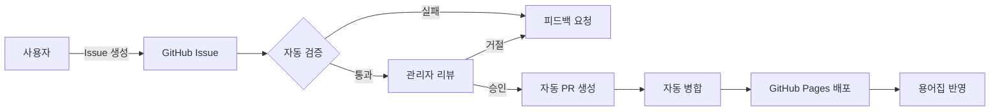

# AI/ML 한국어 용어집 (Korean AI/ML Glossary)

<div align="center">

[](https://opensource.org/licenses/MIT)
[](https://github.com/9bow/kr-glossary/stargazers)
[](https://github.com/9bow/kr-glossary/issues)
[](https://9bow.github.io/kr-glossary)

**GitHub 기반 협업 AI/ML 용어집 프로젝트**

*커뮤니티가 함께 만들어가는 AI/ML 한국어 용어 표준화 플랫폼*

[용어집 보기](https://9bow.github.io/kr-glossary) • [용어 제안하기](https://github.com/9bow/kr-glossary/issues/new?template=term-addition.yml) • [기여하기](#-기여-방법)

</div>

## 프로젝트 소개

AI/ML 한국어 용어집은 **GitHub Issues와 Actions를 활용한 완전 자동화된 협업 플랫폼**입니다.
복잡한 PR 과정 없이 Issue 템플릿을 통해 누구나 쉽게 용어를 제안하고, 전문가 검토를 거쳐 자동으로 반영됩니다.

### 핵심 특징

- **완전 자동화**: GitHub Issues → 검증 → PR 생성 → 배포까지 자동 처리
- **커뮤니티 주도**: 누구나 Issue를 통해 용어 제안 및 개선 가능
- **품질 관리**: 자동 검증 + 전문가 리뷰 시스템
- **실시간 배포**: 승인된 내용 즉시 GitHub Pages 반영
- **투명한 프로세스**: 모든 과정이 GitHub에서 추적 가능

## 빠른 시작

### 용어 추가하기 (사용자)

1. **[용어 추가 Issue 생성](https://github.com/9bow/kr-glossary/issues/new?template=term-addition.yml)**
2. 템플릿에 따라 정보 입력
3. 자동 검증 통과 대기
4. 관리자 승인 후 자동 반영

> 복잡한 Git 명령어나 PR 생성 불필요! Issue만 작성하면 끝!

### 용어 검색하기

**[https://9bow.github.io/kr-glossary](https://9bow.github.io/kr-glossary)** 에서:
- 한글/영어 실시간 검색
- 카테고리별 필터링
- 상세 설명 및 예시 확인
- Giscus 댓글로 토론 참여

## GitHub 중심 워크플로우



### 지원되는 Issue 유형

| Issue 템플릿 | 설명 | 자동화 수준 |
|------------|------|-----------|
| 용어 추가 | 새로운 AI/ML 용어 제안 | 완전 자동화 |
| 용어 수정 | 기존 용어 개선 | 완전 자동화 |
| 기여자 등록 | 기여자 정보 추가 | 완전 자동화 |
| 조직 등록 | 참여 조직 추가 | 완전 자동화 |
| 관리자 추천 | 새 관리자 추천 | 반자동 |
| 검증 기관 등록 | 용어 검증 기관 추가 | 반자동 |

## 기술 스택

### Frontend
- **React 19** + **TypeScript** - 모던 웹 애플리케이션
- **Material-UI** - 일관된 디자인 시스템
- **Vite** - 빠른 개발 환경
- **Fuse.js** - 한글 퍼지 검색 지원

### Backend (GitHub 기반)
- **GitHub Issues** - 데이터 입력 인터페이스
- **GitHub Actions** - 자동화 워크플로우
- **GitHub Pages** - 정적 사이트 호스팅
- **Python Scripts** - 데이터 검증 및 처리

### 자동화 시스템
- **Issue Validation** - 실시간 입력 검증
- **Auto PR Creation** - 승인 시 자동 PR 생성
- **Continuous Deployment** - main 브랜치 자동 배포
- **Preview Builds** - PR별 미리보기 환경

## 프로젝트 구조

```
kr-glossary/
├── .github/
│   ├── ISSUE_TEMPLATE/      # Issue 템플릿
│   ├── workflows/            # GitHub Actions 워크플로우
│   ├── scripts/              # 자동화 스크립트
│   └── config/               # 관리자 설정
├── data/                     # 용어 데이터 (자동 관리)
│   ├── terms/               # 용어 데이터
│   ├── contributors/        # 기여자 정보
│   └── organizations/       # 조직 정보
├── src/                     # React 애플리케이션
│   ├── components/          # UI 컴포넌트
│   ├── pages/              # 페이지 컴포넌트
│   └── utils/              # 유틸리티 함수
└── scripts/                 # 빌드 및 검증 스크립트
```

## 기여 방법

### 1. Issue를 통한 기여 (권장)

**코드 작성 없이 기여하기:**
1. 적절한 [Issue 템플릿](https://github.com/9bow/kr-glossary/issues/new/choose) 선택
2. 템플릿 양식에 맞춰 작성
3. 자동 검증 통과 확인
4. 관리자 승인 대기

### 2. 코드 기여 (개발자)

**기능 개선 및 버그 수정:**
```bash
# 1. Fork & Clone
git clone https://github.com/[your-username]/kr-glossary
cd kr-glossary

# 2. 의존성 설치
npm install

# 3. 개발 서버 실행
npm run dev

# 4. 변경사항 작업
# ...

# 5. PR 생성
```

### 3. 리뷰어로 참여

- Issue 및 PR 검토
- 용어 정확성 검증
- 개선사항 제안

### 주요 관리 기능
- Issue 라벨 관리 및 승인
- 자동화 워크플로우 모니터링
- 데이터 품질 관리
- 커뮤니티 모더레이션

## 프로젝트 통계

<div align="center">

| 메트릭 | 상태 |
|--------|------|
| 총 용어 수 |  |
| 기여자 수 |  |
| 이슈 |  |
| PR |  |

</div>
